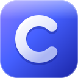

  

<h1 align="center">Cobalt64</h1>

  <b>The first open-source GPU-accelerated graphics driver for macOS.</b> 
  Native Metal acceleration for modern AMD Radeon GPUs that Apple does not support.

  
  
  

  
  

  <a href="https://cobalt64.com"><b>Visit cobalt64.com</b></a> to check whether your graphics card is supported,
  read how Cobalt64 works and get the first public release when it ships.

---

## About

Apple's own AMD drivers end with RDNA 2. Cobalt64 is an open-source graphics driver that
brings modern Radeon GPUs to macOS: it brings up the GPU itself, runs Metal on top of a
macOS port of Mesa's RADV Vulkan driver, and drives the displays natively.

The first supported family is **RDNA 4**, starting with the **Radeon RX 9070 XT (Navi 48)**,
where all development and testing happens today. Other families (for example RDNA 3 /
RX 7000) are future work: much of the stack is shared, but each GPU generation needs its own
display and power-management bring-up, and someone with that hardware to test it.

## Status

Reached on one x86_64 test PC with an RX 9070 XT, macOS Tahoe 26.6.2, booted through OpenCore:

- **GPU-composited desktop on three displays at once** (one DisplayPort, two HDMI), with
  WindowServer's Metal compositor running on this driver stack.
- **Apps on the GPU:** a growing set of built-in apps (Maps, Preview, Photos, System Settings,
  Music and others) render through it.
- **Resizable BAR**, and the driver arming itself at boot.

This is a **preview**: a lot is still rough, display modes are limited to what the test PC's
monitors needed, and many pieces work around one specific macOS build.

### In progress

- 4K output over HDMI
- Smoother frame pacing and higher refresh rates
- GPU rendering for more apps (Safari, Chromium/Electron apps)
- Display modes from each monitor's EDID instead of fixed modes
- Hardware video decoding

## Can I install this?

**Not yet.** Wait for the first public release; it will come with an installer and a
step-by-step guide on [cobalt64.com](https://cobalt64.com). This repository is the source
code, and running it today needs a lot of manual setup on a separate macOS install.

## What this repo contains

| Path | Contents |
|---|---|
| `src/navi48-bringup` | Bring-up kext (IOKit): PCIe/BAR setup, IP discovery, PSP/SMU/GMC/GFX/SDMA/MES initialisation, display (DCN 4.1) mode-setting, a user client ("N48N") exposing buffers, command submission and scanout, and hooks into Apple's AMDRadeonX6000 accelerator. |
| `src/dcn41` | DCN 4.1 display-engine helpers and generated register headers (derived from Linux amdgpu, MIT). |
| `src/xlat12` | Command-stream translation from Apple's GFX10.3 PM4/register programming to gfx12. |
| `src/g2capture` | Small capture tool for Apple shader-compiler records. |
| `tools/native` | navi48metal (a Metal device bundle that runs Metal on top of the Vulkan driver), mtlprobe (API probe), autotranslate (AIR -> SPIR-V translation scripts) and navi48accel (aux kext). |
| `tools/pc`, `tools/dcn41`, `tools/conductor` | PC-side test CLI and run scripts, display-register tooling, test suite runners and "planted break" mutation tests. |
| `mesa-patches` | RADV (Mesa Vulkan) Darwin port as nine patches on a pinned Mesa commit; see `mesa-patches/README.txt`. |

## External projects and dependencies (not vendored; clone them yourself)

| Project | Where | Notes |
|---|---|---|
| RDNA4FB | https://github.com/somestupidgirl/RDNA4FB | display-only RDNA4 kext, MacKernelSDK |
| mac-amdgpu | https://github.com/lemonade-sdk/mac-amdgpu | Navi 48 bring-up on macOS |
| USBToolBox | https://github.com/USBToolBox/tool | USB port mapping, optional |
| metal2vulkan | https://github.com/steelbrain/metal2vulkan | Metal AIR -> SPIR-V translator, LGPL-3.0-or-later; upstream is not included. Our changes and the n48xlate in-process wrapper are in `third-party/metal2vulkan-n48/`, LGPL-3.0, separate from the MIT code here; see its NOTICE |
| Mesa | https://gitlab.freedesktop.org/mesa/mesa | RADV, MIT; see `mesa-patches/` |
| linux-firmware | | AMD firmware blobs, own licence; see above |

## Credits

RDNA4FB (Sunneva N. Mariudottir), mac-amdgpu (lemonade-sdk / Geramy Loveless), the Mesa
project (RADV and the register databases), the Linux amdgpu driver authors at AMD and the
community (register definitions and documentation), and the metal2vulkan author (steelbrain).

Cobalt64 is an independent project and is not affiliated with or endorsed by AMD or Apple.
AMD, Radeon and RDNA are trademarks of Advanced Micro Devices, Inc. Apple, Mac, macOS and Metal
are trademarks of Apple Inc. Kernel extensions write directly to the hardware: use at your own risk.
